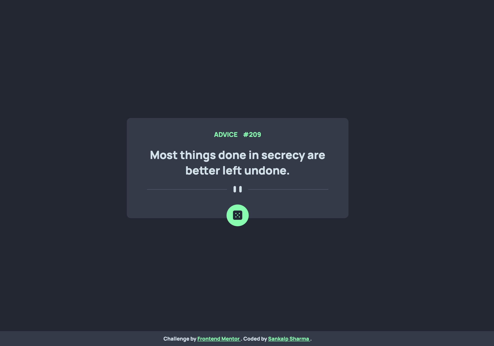

# Frontend Mentor - Advice generator app solution

This is a solution to the [Advice generator app challenge on Frontend Mentor](https://www.frontendmentor.io/challenges/advice-generator-app-QdUG-13db). Frontend Mentor challenges help you improve your coding skills by building realistic projects.

## Table of contents

- [Overview](#overview)

  - [Screenshot](#screenshot)
  - [Links](#links)

- [My process](#my-process)
  - [Built with](#built-with)
  - [What I learned](#what-i-learned)
- [Author](#author)

### Screenshot



### Links

- Solution URL: [Advice Generator App Solution](https://github.com/sankalpsharmaofficial/Advice-generator-app-using-api)
- Live Site URL: [Advice Generator App](https://advice-generator-app-using-api.vercel.app/)

## My process

### Built with

- Semantic HTML5 markup
- CSS custom properties
- Flexbox
- CSS Grid
- Mobile-first workflow
- Javascript

### What I learned

I learned how to use an API and fetch the data and then showcase the data in a
aesthetically pleasing way. The API generates a random advice which is displayed on the page, to genereate a new advice we can click on the dice button below to generate a random advice.

To see how you can add code snippets, see below:

```css
.proud-of-this-css {
	dice: code-below;
}
#dice {
	background-color: var(--Neon-Green);
	border-radius: 50%;
	padding: 15px 16px 12px;
	border: 0;
	cursor: pointer;
	margin: 0 auto -50px;
}
#dice img {
	width: 23px;
}
#dice:hover {
	box-shadow: 0 0 40px var(--Neon-Green);
}
```

## Author

- Profile-Card - [Sankalp Sharma](https://sankalpsharmaofficial.github.io/)
- Website - [Sankalp Sharma](https://sankalpsharma.vercel.app/)
- Frontend Mentor - [@sankalpsharmaofficial](https://www.frontendmentor.io/profile/sankalpsharmaofficial)
- Twitter - [@sankalp0501](https://twitter.com/sankalp0501)
